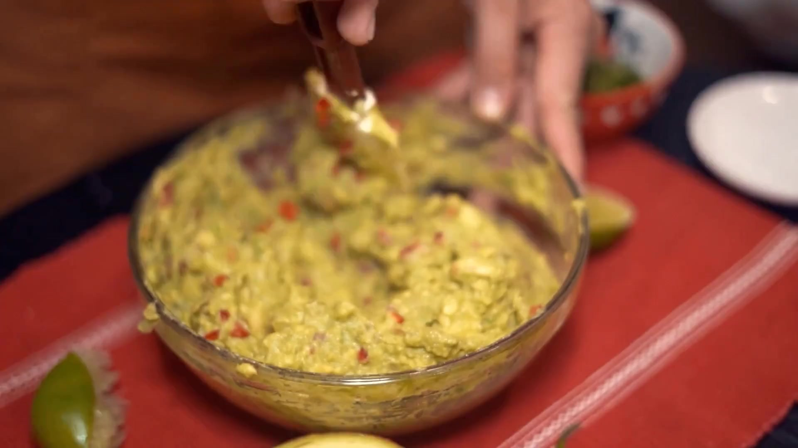

<p align="center">
    
</p>

### [Product Website](https://www.nvidia.com/en-us/ai/cosmos/) | [Hugging Face](https://huggingface.co/collections/nvidia/cosmos-predict2-68028efc052239369a0f2959) | [Paper](https://arxiv.org/abs/2501.03575) | [Paper Website](https://research.nvidia.com/labs/dir/cosmos-predict1)

Cosmos-Predict2 is a key branch of Cosmos World Foundation Models (WFMs) specialized for future state prediction, often referred to as world models. The three main branches of Cosmos WFMs are [cosmos-predict](https://github.com/nvidia-cosmos/cosmos-predict2), [cosmos-transfer](https://github.com/nvidia-cosmos/cosmos-transfer1), and [cosmos-reason](https://github.com/nvidia-cosmos/cosmos-reason1). We visualize the architecture of Cosmos-Predict2 in the following figure.

<p align="center">
    
</p>

## Key Features
Cosmos-Predict2 includes the following:

- **Diffusion-based world foundation models** for Text2Image and Video2World generation, where a user can generate visual simulation based on text prompts or video prompts.

## News
- [2025/05] Initial release of Predict2! This is a major upgrade from Predict1. Please try it out and give us feedback. 

## Examples

### Text2Image

<table>
  <tr>
    <td width="50%">
      <div align="center"><b>Input Prompt</b></div>
      <sub>Two cyclists ride along a smooth, open road lined with tall pine trees under soft natural light. The rider in the foreground, wearing a blue helmet, red-accented black jacket, and cycling gloves, maintains a focused expression as he leans forward, gripping the handlebars. Behind him, another cyclist dressed in all black follows closely, his posture slightly hunched and his expression engaged. The motion blur on the road surface and trees enhances the sense of speed and fluidity. The camera captures the scene from a low, side angle, emphasizing the dynamic forward movement through the serene forested environment.</sub>
    </td>
    <td width="50%">
      <div align="center"><b>Output Image</b></div>
      
    </td>
  </tr>
</table>

<table>
  <tr>
    <td width="50%">
      <div align="center"><b>Input Prompt</b></div>
      <sub>A person is mixing guacamole in a glass bowl with a wooden spoon. Their hands are actively stirring the mixture, which includes chunks of avocado, red chili peppers, and other ingredients. The bowl is placed on a red placemat with white stripes, and there are lime halves and a small bowl of additional ingredients nearby. The person is wearing a brown apron, suggesting they are preparing food. The setting appears to be a kitchen or dining area, with a casual and homey atmosphere. The camera focuses closely on the bowl and the person's hands, capturing the detailed action of mixing the guacamole.</sub>
    </td>
    <td width="50%">
      <div align="center"><b>Output Image</b></div>
      
    </td>
  </tr>
</table>

### Video2World

<table>
  <tr>
    <td colspan="2">
      <div align="center"><b>Input Prompt</b></div>
      <sub>A wide-angle shot captures a sunny suburban street intersection, where the bright sunlight casts sharp shadows across the road. The scene is framed by a row of houses with beige and brown roofs, and lush green lawns. Autumn-colored trees add vibrant red and orange hues to the landscape. Overhead power lines stretch across the sky, and a fire hydrant is visible on the right side of the frame near the curb. A silver sedan is parked on the driveway of a house on the left, while a silver SUV is parked on the street in front of the house at the center of the camera view. The ego vehicle waits to turn right at the t-intersection, yielding to two other vehicles traveling in opposite directions. A black car enters the frame from the right, driving across the intersection and continuing straight ahead. The car's movement is smooth and steady, and it exits the frame to the left. The final frame shows the intersection with a vehicle moving from the left to the right side, the silver sedan and the SUV still parked in their initial positions, and the black car having moved out of view.</sub>
    </td>
  </tr>
  <tr>
    <td>
      <div align="center"><b>Input Image</b></div>
      
    </td>
    <td>
      <div align="center"><b>Output Video</b></div>
      <video width="512" src="https://github.com/user-attachments/assets/4609f28b-b661-4632-a34e-78c453b2cbde"></video>
    </td>
  </tr>
</table>

<table>
  <tr>
    <td colspan="2">
      <div align="center"><b>Input Prompt</b></div>
      <sub>The video opens with a view of a testing environment, characterized by a large wooden table at the center. On this table, two robot arms are positioned at opposite ends, with the left arm closer to the camera and the right arm further away. Between the hands lies a dark wooden shelf with a red spherical object on its top rack, likely serving as a platform or obstacle. In the background, various pieces of equipment, including a tripod, a chair, are visible. A person wearing a blue jacket and black pants stands near the center of the room, observing the experiment, with a static hand position throughout. The floor is tiled with a patterned design, and additional items like a small robot figure and some cables can be seen scattered around the space.  As the video progresses, the right robotic hand extends outward, moving from its initial position towards the red spherical object on the shelf. The hand then picks up the object and places it on the lowest rack of the shelf, completing a smooth, deliberate manipulation. The left robotic hand remains stationary throughout the sequence. No new objects appear in the video; all existing elements maintain their positions except for the movement of the right robotic hand. The scene concludes with the right robotic hand returning to its initial position, while the left hand continues to rest on the table. The overall environment remains unchanged, with the focus remaining on the interaction between the robotic hands and the wooden block, highlighting precise control during the demonstration.</sub>
    </td>
  </tr>
  <tr>
    <td>
      <div align="center"><b>Input Image</b></div>
      
    </td>
    <td>
      <div align="center"><b>Output Video</b></div>
      <video width="512" src="https://github.com/user-attachments/assets/feb5a8e1-2256-4373-9dd5-4145204c65f5"></video>
    </td>
  </tr>
</table>

## System Requirements
Cosmos-Predict2 has the following system requirements:
* NVIDIA GPUs with Ampere architecture (RTX 30 Series, A100) or newer architectures. For detailed hardware requirements and recommendations, please refer to our [performance benchmarks](#performance-benchmarks).
* Linux operating system (Ubuntu 20.04, 22.04, or 24.04 LTS)
* CUDA version 12.4 or later
* Python version 3.10 or later

## Documentation
See below for quickstart installation and usage examples. 

### Install
Clone the `cosmos-predict2` source code
```bash
git clone git@github.com:nvidia-cosmos/cosmos-predict2.git
cd cosmos-predict2
```

> ℹ️ Cosmos runs only on Linux systems. We have tested the installation with Ubuntu 24.04, 22.04, and 20.04.
> ℹ️ Cosmos requires the Python version to be `3.10.x`. Please also make sure you have `conda` installed ([instructions](https://docs.conda.io/projects/conda/en/latest/user-guide/install/index.html)).

The below commands creates the `cosmos-predict2` conda environment and installs the dependencies for inference:
```bash
# Create the cosmos-predict2 conda environment.
conda env create --file cosmos-predict2.yaml
# Activate the cosmos-predict2 conda environment.
conda activate cosmos-predict2
# Install the dependencies.
pip install -r requirements.txt
pip install flash-attn==2.7.4.post1 --no-build-isolation
# Patch Transformer engine linking issues in conda environments.
ln -sf $CONDA_PREFIX/lib/python3.10/site-packages/nvidia/*/include/* $CONDA_PREFIX/include/
ln -sf $CONDA_PREFIX/lib/python3.10/site-packages/nvidia/*/include/* $CONDA_PREFIX/include/python3.10
# Install Transformer engine.
pip install transformer-engine[pytorch]==1.12.0
```

You can test the environment setup for inference with
```bash
CUDA_HOME=$CONDA_PREFIX PYTHONPATH=$(pwd) python scripts/test_environment.py
```

Upcoming: we are working on easier installations options including a packaged Docker image. If you have questions of feedback, please file an issue and we will follow up!

### Download checkpoints
1. Generate a [Hugging Face](https://huggingface.co/settings/tokens) access token (if you haven't done so already). Set the access token to `Read` permission (default is `Fine-grained`).

2. Log in to Hugging Face with the access token:
   ```bash
   huggingface-cli login
   ```
3. Accept the [Llama-Guard-3-8B terms](https://huggingface.co/meta-llama/Llama-Guard-3-8B)

4. Download the Cosmos model weights from [Hugging Face](https://huggingface.co/collections/nvidia/cosmos-predict2-68028efc052239369a0f2959):
   ```bash
   CUDA_HOME=$CONDA_PREFIX PYTHONPATH=$(pwd) python scripts/download_diffusion_checkpoints.py --model_sizes 2B 14B --model_types Text2Image --checkpoint_dir checkpoints
   CUDA_HOME=$CONDA_PREFIX PYTHONPATH=$(pwd) python scripts/download_diffusion_checkpoints.py --model_sizes 2B 14B --model_types Video2World --checkpoint_dir checkpoints

### Inference with pre-trained Cosmos-Predict2 models
* [Inference with diffusion-based Text2Image models](/examples/inference_diffusion_text2image.md)
* [Inference with diffusion-based Video2World models](/examples/inference_diffusion_video2world.md)

## Models

Cosmos-Predict2 include the following models

* [Cosmos-Predict2-2B-Text2Image](https://huggingface.co/nvidia/Cosmos-Predict2-2B-Text2Image): Text to image generation
* [Cosmos-Predict2-14B-Text2Image](https://huggingface.co/nvidia/Cosmos-Predict2-14B-Text2Image): Text to image generation
* [Cosmos-Predict2-2B-Video2World](https://huggingface.co/nvidia/Cosmos-Predict2-2B-Video2World): Video + Text based future visual world generation
* [Cosmos-Predict2-14B-Video2World](https://huggingface.co/nvidia/Cosmos-Predict2-14B-Video2World): Video + Text based future visual world generation

## Performance Benchmarks

Here are the GPU memory requirements for each model in our suite:

|                      | Cosmos-Predict2-2B-Text2Image | Cosmos-Predict2-14B-Text2Image | Cosmos-Predict2-2B-Video2World | Cosmos-Predict2-14B-Video2World |
|---------------------------------|-----------------------------------|-----------------------------------|-----------------------------------|-----------------------------------|
| Required GPU VRAM | 26.02 GB | 48.93 GB | 32.54 GB | 56.38 GB |

The following benchmarks provide detailed performance metrics across different GPU hardware (for a single generation):

| GPU Hardware                     | Cosmos-Predict2-2B-Text2Image | Cosmos-Predict2-14B-Text2Image | Cosmos-Predict2-2B-Video2World | Cosmos-Predict2-14B-Video2World |
|---------------------------------|-----------------------------------|-----------------------------------|-----------------------------------|-----------------------------------|
| NVIDIA GB200 | 3.39 sec | 8.5 sec | 25.61 sec | 85.26 sec |
| NVIDIA B200 | 3.24 sec | 8.68 sec | 30.7 sec | 92.59 sec |
| NVIDIA RTX PRO 6000 Workstation Edition | 5.59 sec | 24.16 sec | 82.43 sec | 321.9 sec |
| NVIDIA DGX Spark | 24.87 sec | 138.94 sec | 344.64 sec | 1902.26 sec |
| NVIDIA H200 SXM | 9.02 sec | 15.96 sec | 50.2 sec | 176.19 sec |
| NVIDIA H200 NVL | 6.34 sec | 16.95 sec | 54.01 sec | 203.56 sec |
| NVIDIA H100 PCIe | 11.12 sec | 23.83 sec | 79.87 sec | 286.46 sec |
| NVIDIA H100 NVL | 5.05 sec | 23.97 sec | 87.32 sec | 377.67 sec |
| NVIDIA H20 | 11.47 sec | 59.59 sec | 179.69 sec | 852.64 sec |
| NVIDIA L40S | 8.9 sec | (OOM) | 127.49 sec | 1036.24 sec |
| NVIDIA RTX 6000 Ada Generation | 11.94 sec | 167.86 sec | 180.99 sec | 876.68 sec |

### Which models should I use?

The choice between 2B and 14B models depends on your specific needs, hardware constraints, and performance requirements:

#### Use 2B models when:
- You need faster inference times and lower latency
- You have limited GPU memory (requires ~26-33GB VRAM)
- Your use case involves simpler scenes and compositions
- You're doing rapid prototyping or testing
- You need to process a large batch of images/videos efficiently

#### Use 14B models when:
- You need higher quality and more detailed outputs
- You have sufficient GPU resources (requires ~49-57GB VRAM)
- Your use case involves complex scenes with intricate details
- Output quality is prioritized over generation speed
- You're working on final production assets

The 14B models generally produce higher fidelity results with better coherence and detail, but come with increased computational costs. The 2B models offer a good balance of quality and performance for many practical applications while being more resource-efficient.

For most development and testing scenarios, starting with the 2B models is recommended. You can then scale up to 14B models when higher quality is needed and hardware resources permit.

## Contribute

We thrive on community collaboration! [NVIDIA-Cosmos](https://github.com/nvidia-cosmos/) wouldn’t be where it is without contributions from developers like you. Check out our [Contributing Guide](CONTRIBUTING.md) to get started, and share your feedback through issues.

Big thanks 🙏 to everyone helping us push the boundaries of open-source physical AI!
<!-- ------------------------------ -->

## License and Contact

This project will download and install additional third-party open source software projects. Review the license terms of these open source projects before use.

This model includes safety and content moderation features powered by Llama Guard 3. Llama Guard 3 is used solely as a content input filter and is subject to its own license.

NVIDIA Cosmos source code is released under the [Apache 2 License](https://www.apache.org/licenses/LICENSE-2.0).

NVIDIA Cosmos models are released under the [NVIDIA Open Model License](https://www.nvidia.com/en-us/agreements/enterprise-software/nvidia-open-model-license). For a custom license, please contact [cosmos-license@nvidia.com](mailto:cosmos-license@nvidia.com).
